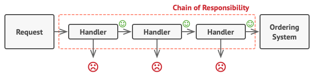

**Chain of Responsibility** is a behavioral design pattern that lets you pass requests along a chain of handlers. Upon receiving a request, each handler decides either to process the request or to pass it to the next handler in the chain.

## Problem

Imagine that you’re working on an online ordering system. You want to restrict access to the system so only authenticated users can create orders. Also, users who have administrative permissions must have full access to all orders.

After a bit of planning, you realized that these checks must be performed sequentially. The application can attempt to authenticate a user to the system whenever it receives a request that contains the user’s credentials. However, if those credentials aren’t correct and authentication fails, there’s no reason to proceed with any other checks.

## Solution 
Like many other behavioral design patterns, the Chain of Responsibility relies on transforming particular behaviors into stand-alone objects called handlers.
The pattern suggests that you link these handlers into a chain. Each linked handler has a field for storing a reference to the next handler in the chain. In addition to processing a request, handlers pass the request further along the chain. The request travels along the chain until all handlers have had a chance to process it.

## Goal 
 Use the Chain of Responsibility pattern when your program is expected to process different kinds of requests in various ways, but the exact types of requests and their sequences are unknown beforehand.