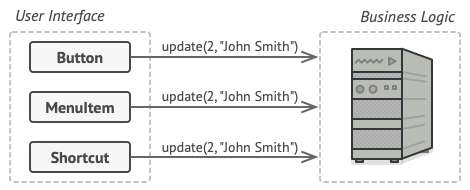
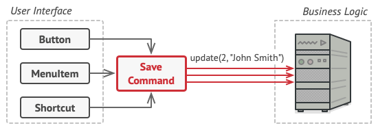

**Command** is a behavioral design pattern that turns a request into a stand-alone object that contains all information about the request. This transformation lets you pass requests as a method arguments, delay or queue a request’s execution, and support undoable operations.

## Problem
Imagine that you’re working on a new text-editor app. Your current task is to create a toolbar with a bunch of buttons for various operations of the editor. While all of these buttons look similar, they’re all supposed to do different things. Where would you put the code for the various click handlers of these buttons? The simplest solution is to create tons of subclasses for each place where the button is used.

## Solution 
The most common example: a layer for the graphical user interface and another layer for the business logic. The GUI layer is responsible for rendering a beautiful picture on the screen, capturing any input and showing results of what the user and the app are doing. However, when it comes to doing something important, like calculating the trajectory of the moon or composing an annual report, the GUI layer delegates the work to the underlying layer of business logic.

The Command pattern suggests that GUI objects shouldn’t send these requests directly. Instead, you should extract all of the request details, such as the object being called, the name of the method and the list of arguments into a separate command class with a single method that triggers this request.

## Goal 
- Use the Command pattern when you want to parametrize objects with operations.
- Use the Command pattern when you want to queue operations, schedule their execution, or execute them remotely.
-  Use the Command pattern when you want to implement reversible operations.