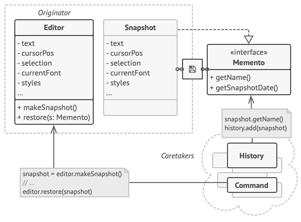

**Memento** is a behavioral design pattern that lets you save and restore the previous state of an object without revealing the details of its implementation.

## Problem
Imagine that you’re creating a text editor app. In addition to simple text editing, your editor can format text, insert inline images, etc.

At some point, you decided to let users undo any operations carried out on the text. Before performing any operation, the app records the state of all objects and saves it in some storage. Later, when a user decides to revert an action, the app fetches the latest snapshot from the history and uses it to restore the state of all objects.

Let’s think about those state snapshots. How exactly would you produce one? You’d probably need to go over all the fields in an object and copy their values into storage. However, this would only work if the object had quite relaxed access restrictions to its contents. Unfortunately, most real objects won’t let others peek inside them that easily, hiding all significant data in private fields. To make a snapshot, you’d need to collect these values and put them into some kind of container.

Most likely, you’re going to store lots of these container objects inside some list that would represent the history. Therefore the containers would probably end up being objects of one class. The class would have almost no methods, but lots of fields that mirror the editor’s state. To allow other objects to write and read data to and from a snapshot, you’d probably need to make its fields public. That would expose all the editor’s states, private or not. Other classes would become dependent on every little change to the snapshot class, which would otherwise happen within private fields and methods without affecting outer classes.

## Solution 
All problems that we’ve just experienced are caused by broken encapsulation. Some objects try to do more than they are supposed to. To collect the data required to perform some action, they invade the private space of other objects instead of letting these objects perform the actual action.

The Memento pattern delegates **creating the state snapshots to the actual owner of that state,** the originator object. Hence, instead of other objects trying to copy the editor’s state from the “outside,” the editor class itself can make the snapshot since it has full access to its own state. 
