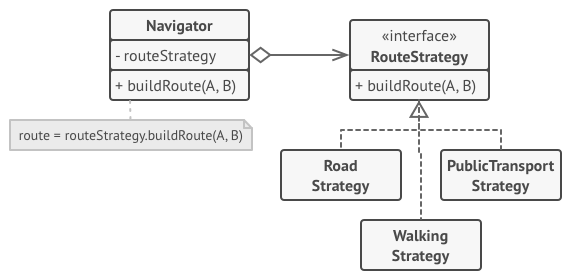

**Strategy** is a behavioral design pattern that lets you define a family of algorithms, put each of them into a separate class, and make their objects interchangeable.

## Problem
One day you decided to create a navigation app for casual travelers. The app was centered around a beautiful map which helped users quickly orient themselves in any city.

One of the most requested features for the app was automatic route planning. A user should be able to enter an address and see the fastest route to that destination displayed on the map.

The first version of the app could only build the routes over roads. People who traveled by car were bursting with joy. But apparently, not everybody likes to drive on their vacation. So with the next update, you added an option to build walking routes. Right after that, you added another option to let people use public transport in their routes.

## Solution 
The Strategy pattern suggests that you take a class that does something specific in a lot of different ways and extract all of these algorithms into separate classes called strategies.

The original class, called context, must have a field for storing a reference to one of the strategies. The context delegates the work to a linked strategy object instead of executing it on its own. The context isn’t responsible for selecting an appropriate algorithm for the job. Instead, the client passes the desired strategy to the context. Context works with all strategies through the same generic interface.
