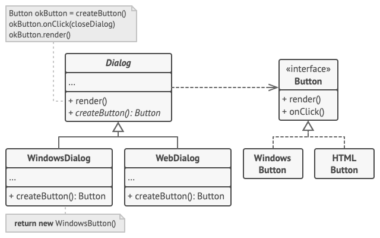

<b>Factory Method</b> is a creational design pattern that provides an interface for creating objects in a superclass, but allows subclasses to alter the type of objects that will be created.

## Problem
Imagine that you’re creating a logistics management application. The first version of your app can only handle transportation by trucks, so the bulk of your code lives inside the `Truck` class.
But then yo need to add sea logistics into the app. Adding `Ship` into the app would require making changes to the entire codebase

## Solution 
The Factory Method pattern suggests that you replace direct object construction calls (using the new operator) with calls to a special factory method. Don’t worry: the objects are still created via the new operator, but it’s being called from within the factory method. Objects returned by a factory method are often referred to as products.

