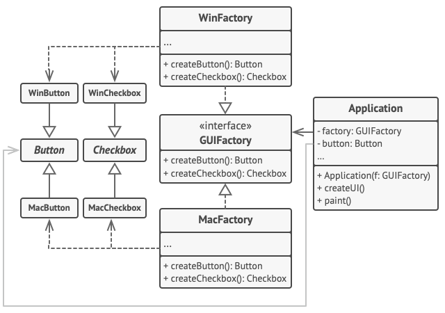

<b>Abstract Factory</b> is a creational design pattern that lets you produce families of related objects without specifying their concrete classes.

## Problem
Imagine that you’re creating a furniture shop simulator. Your code consists of classes that represent:
- A family of related products, say: Chair + Sofa + CoffeeTable.
- Several variants of this family. For example, products Chair + Sofa + CoffeeTable are available in these variants: Modern, Victorian, ArtDeco.

You need a way to create individual furniture objects so that they match other objects of the same family. Customers get quite mad when they receive non-matching furniture.

## Solution 
The first thing the Abstract Factory pattern suggests is to explicitly declare interfaces for each distinct product of the product family 
The next move is to declare the Abstract Factory—an interface with a list of creation methods for all products that are part of the product family. These methods must return abstract product types represented by the interfaces we extracted previously: Chair, Sofa, CoffeeTable and so on.

### Note:

The different between this method and factory method is that:
- Abstract method is return interface 
- Factory method is return instant 
