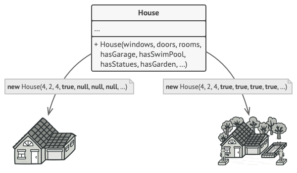
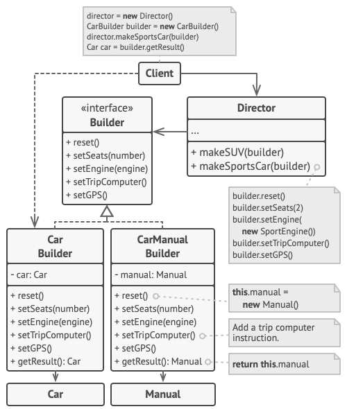

**Builder** is a creational design pattern that lets you construct complex objects step by step. The pattern allows you 
to produce different types and representations of an object using the same construction code.

## Problem
Imagine a complex object that requires laborious, step-by-step initialization of many fields and nested objects. Such 
initialization code is usually buried inside a monstrous constructor with lots of parameters. Or even worse: scattered 
all over the client code.

## Solution 
The Builder pattern suggests that you extract the object construction code out of its own class and move it to separate 
objects called builders. The pattern organizes object construction into a set of steps (buildWalls, buildDoor, etc.). 
To create an object, you execute a series of these steps on a builder object. **The important part is that you don’t need 
to call all of the steps. You can call only those steps that are necessary for producing a particular configuration of an object.**

### Director
The director class defines the order in which to execute the building steps, while the builder provides the 
implementation for those steps.

