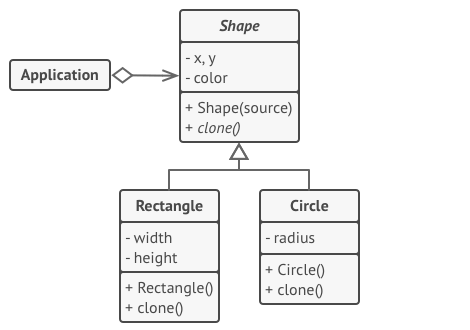

**Prototype** is a creational design pattern that lets you copy existing objects without making your code dependent 
on their classes.

## Problem
Say you have an object, and you want to create an exact copy of it. How would you do it?
First, you have to create a new object of the same class. Then you have to go through all
the fields of the original object and copy their values over to the new object.  
Nice! But there’s a catch. Not all objects can be copied that way because some of the 
object’s fields may be private and not visible from outside of the object itself.

## Solution
The pattern declares a common interface for all objects that support cloning.
This interface lets you clone an object without coupling your code to the class of 
that object. Usually, such an interface contains just a single `clone` method.
 
The implementation of the clone method is very similar in all classes. The method creates an object of the current class
and carries over all of the field values of the old object into the new one. You can even copy private fields because 
most programming languages let objects access private fields of other objects that belong to the same class.
 
_**Here’s how it works: you create a set of objects, configured in various ways. When you need an object like the 
one you’ve configured, you just clone a prototype instead of constructing a new object from scratch.**_
