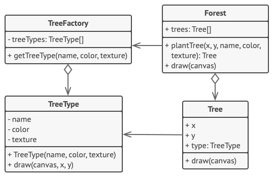

**Flyweight** is a structural design pattern that lets you fit more objects into the available amount of RAM by sharing common parts of state between multiple objects instead of keeping all of the data in each object.

## Problem
The actual problem was related to your particle system. Each particle, such as a bullet, a missile or a piece of shrapnel was represented by a separate object containing plenty of data. At some point, when the carnage on a player’s screen reached its climax, newly created particles no longer fit into the remaining RAM, so the program crashed.
## Solution
The Flyweight pattern suggests that you stop storing the extrinsic state inside the object. Instead, you should pass this state to specific methods which rely on it. Only the intrinsic state stays within the object, letting you reuse it in different contexts. As a result, you’d need fewer of these objects since they only differ in the intrinsic state, which has much fewer variations than the extrinsic.

## Goal
Use the Flyweight pattern only when your program must support a huge number of objects which barely fit into available RAM.

